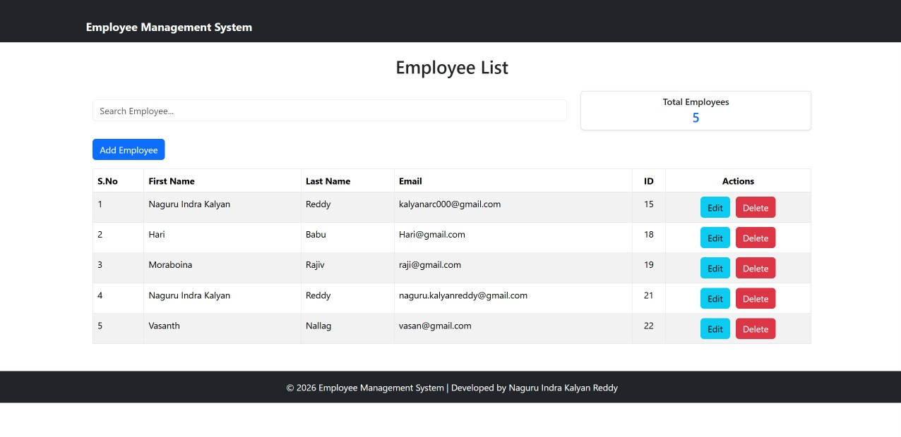
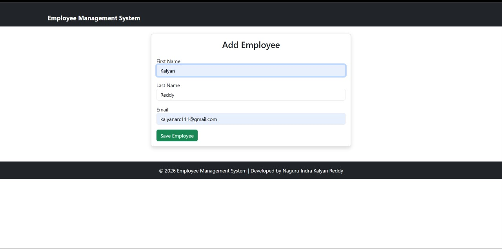
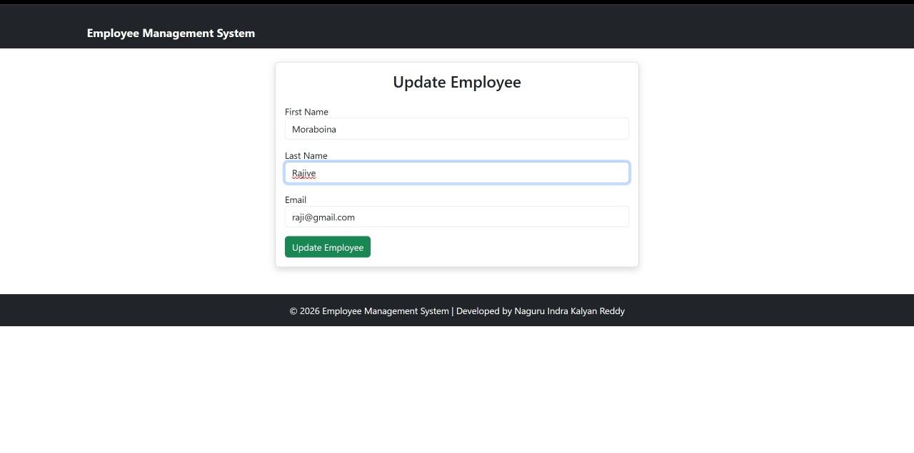

# Employee Management System

A Full Stack Employee Management System developed using Spring Boot, React.js, MySQL, and REST APIs. This application allows users to perform CRUD (Create, Read, Update, Delete) operations on employee records through a responsive web interface.

---

## Features

✅ Add New Employee

✅ View Employee List

✅ Update Employee Details

✅ Delete Employee Records

✅ Search Employees

✅ REST API Integration

✅ MySQL Database Connectivity

✅ Responsive User Interface

---

## Tech Stack

### Frontend
- React.js
- JavaScript
- Bootstrap
- HTML5
- CSS3
- Axios

### Backend
- Java
- Spring Boot
- Spring Data JPA
- Hibernate

### Database
- MySQL

### Tools & Technologies
- Maven
- Git
- GitHub
- VS Code
- MySQL Workbench
- Postman

---

## Project Structure

```text
EmployeeManagementSystem
│
├── backend
│   └── employee-management
│       ├── controller
│       ├── entity
│       ├── repository
│       ├── service
│       └── resources
│
├── frontend
│   └── employee-management-ui
│       ├── components
│       ├── services
│       └── App.js
│
└── screenshots
```

---

## Screenshots

### Employee List Page



---

### Add Employee Page



---

### Update Employee Page



---

## API Endpoints

| Method | Endpoint | Description |
|----------|------------|-------------|
| GET | /employees | Get All Employees |
| GET | /employees/{id} | Get Employee By ID |
| POST | /employees | Add Employee |
| PUT | /employees/{id} | Update Employee |
| DELETE | /employees/{id} | Delete Employee |

---

## Database Schema

### Employee Table

| Column | Type |
|----------|----------|
| id | BIGINT |
| first_name | VARCHAR |
| last_name | VARCHAR |
| email | VARCHAR |

---

## Installation & Setup

### Clone Repository

```bash
git clone https://github.com/Kalyanreddy353/employee-management-system.git
```

### Backend Setup

```bash
cd backend/employee-management
mvn spring-boot:run
```

Backend runs on:

```text
http://localhost:8080
```

---

### Frontend Setup

```bash
cd frontend/employee-management-ui
npm install
npm start
```

Frontend runs on:

```text
http://localhost:3000
```

---

## Future Enhancements

- User Authentication & Authorization
- JWT Security
- Pagination
- Sorting & Filtering
- Dashboard Analytics
- Export Employee Data to Excel/PDF
- Cloud Deployment (AWS/Render)

---

## Author

### Naguru Indra Kalyan Reddy

- Java Full Stack Developer
- Python Developer
- Spring Boot Developer
- React Developer

Email: naguru.kalyanreddy@gmail.com

GitHub: https://github.com/Kalyanreddy353

---

## License

This project is developed for learning, portfolio, and demonstration purposes.
